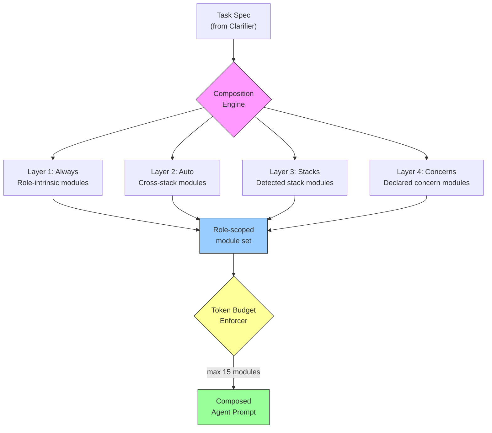

# SuperAgent

**The engineering OS kit for your AI coding agents.**

[](https://github.com/MohamedAbdallah-14/super-agent/actions/workflows/ci.yml)
[](https://github.com/MohamedAbdallah-14/super-agent/blob/main/LICENSE)
[](https://github.com/MohamedAbdallah-14/super-agent/blob/main/CHANGELOG.md)
[](https://nodejs.org/)
[](https://github.com/MohamedAbdallah-14/super-agent/blob/main/CONTRIBUTING.md)


<!-- Demo GIF: record with bash assets/record-demo.sh when asciinema + agg are installed -->

SuperAgent is a host-native engineering OS kit that gives AI coding agents canonical roles, phased workflows, and enforceable quality gates. Install once, export to Claude, Codex, Gemini, or Cursor, and your agent runs the same way your best engineer does.

---

## Why SuperAgent?

AI coding agents fail in the same five ways every time. SuperAgent makes each failure mode structurally impossible.

**Ambiguous specs become wrong code.** The clarifier role escalates unresolved ambiguity instead of assuming. No spec is produced until material questions are answered. Escalation is a required output, not an option.

**Context floods the window.** A 4-layer composition engine assembles only the relevant expertise modules per role per phase from a library of 255 curated modules. The executor gets modules on how to build; the reviewer gets modules on what to flag. Max 15 modules per dispatch, token budget enforced.

**Output quality varies randomly.** The reviewer role is never the phase author. Adversarial review runs at three chokepoints — spec-challenge, plan-review, and final review — always by a different model or model family. Nine hard approval gates block advancement until artifacts are explicitly cleared.

**Good solutions don't persist across runs.** Proposed learnings start isolated. Only explicitly reviewed, scope-tagged learnings get promoted into future runs. Stale or disproven learnings are archived. The system improves per-project without silently drifting.

**Nothing prevents structural failures.** Seven hook contracts enforce protected paths (exit 42), loop caps (exit 43), and session observability. Hooks are enforcement, not suggestions.

---

## Quickstart

**1. Install**

```bash
git clone https://github.com/MohamedAbdallah-14/super-agent.git
cd super-agent && npm install
```

**2. Build host exports**

```bash
npx superagent export build
# Generated host exports for claude, codex, gemini, cursor.
```

**3. Deploy to your project (example: Claude)**

```bash
cp -r exports/hosts/claude/.claude ~/your-project/
cp exports/hosts/claude/CLAUDE.md ~/your-project/
```

**4. Verify**

```bash
npx superagent doctor
# PASS manifest: Manifest is valid.
# PASS hooks: Hook definitions are valid.
# PASS host-exports: All required host export directories exist.
```

Open your AI host in your project directory. Your agent now operates with 10 canonical roles, 255 expertise modules, and a 14-phase delivery pipeline.

---

## How It Works

**Roles are isolation boundaries, not personas.** Each role has defined inputs, allowed tools, required outputs, escalation rules, and failure conditions. An agent inside a role cannot write to protected paths, cannot skip required outputs, and must escalate when ambiguity conditions are met. The discipline is structural, not instructional.

**Phases are artifact checkpoints, not conversation stages.** Every phase consumes a named artifact from the previous phase and produces a named artifact for the next. Nothing flows via conversation history. A session can end, a new agent can pick up the artifacts, and delivery continues — because the handoff is explicit, structured, and schema-validated.

### 14-Phase Delivery Pipeline

```
 [0] clarify       ──► [1] discover     ──► [2] specify      ──► [3] spec-challenge ◄──┐
     clarifier           researcher           specifier            reviewer  ■ GATE     │
                                                                      │                 │
                                                                      ▼ approved        │ rejected
 [6] design-review ◄── [5] design       ◄── [4] author             ─────────────────────┘
     reviewer  ■ GATE       designer          content-author
         │
         ▼ approved
 [7] plan          ──► [8] plan-review   ──► [9] execute     ──► [10] verify
     planner            reviewer  ■ GATE       executor            verifier
                                                                      │
                                                                      ▼
                        [13] prepare-next◄── [12] learn      ◄── [11] review
                             learner          learner              reviewer

 ■ GATE = Approval gate: phase blocks until reviewer explicitly approves.
          Rejection loops back to the authoring phase.
```

### Composition Engine

The composition engine loads the right expertise per role per task. A 4-layer system (always, auto, stacks, concerns) assembles which of 255 expertise modules load into each role's context. The executor gets modules on how to build. The verifier gets modules on what to detect. The reviewer gets modules on what to flag -- all resolved automatically from the task's declared stack and concerns. Max 15 modules per dispatch, token budget enforced.



See [assets/composition-engine.mmd](assets/composition-engine.mmd) for the full diagram with role-specific loading rules.

---

## What's Included

**Stop ambiguity from becoming bugs.** The clarifier and specifier roles turn vague requirements into measurable specs with acceptance criteria. The spec-challenge phase adversarially reviews every spec before planning begins. Ten canonical role contracts define exactly what each agent can access, produce, and escalate. [Roles reference](docs/reference/roles-reference.md)

**Stop context from flooding the window.** 255 curated expertise modules across 11 domains — architecture, security, design, antipatterns, performance, i18n, and more — loaded selectively per role per phase via a 4-layer composition engine. Max 15 modules per dispatch with token budget enforcement. [Expertise reference](docs/reference/expertise-index.md)

**Stop quality from varying randomly.** Adversarial review runs at three chokepoints (spec-challenge, plan-review, final review) by the reviewer role, never the phase author. Nine hard approval gates across a 14-phase pipeline ensure nothing advances on vibes. [Architecture overview](docs/concepts/architecture.md)

**Stop good solutions from being forgotten.** A disciplined learning system promotes scoped knowledge across runs. Proposed learnings require explicit review and scope tagging before promotion. Only learnings whose file patterns overlap the current task are injected into context.

**Stop structural failures before they happen.** Seven hook contracts enforce protected path writes (exit 42), loop caps (exit 43), and session observability. Eleven callable skills — sa:tdd, sa:verification, sa:debugging — enforce exact procedures with evidence at each step. [Skills reference](docs/reference/skills.md) | [Hooks reference](docs/reference/hooks.md)

**Stop hardcoded strings and missing copy.** The content-author role runs before design, producing finalized i18n keys, microcopy, glossary entries, state coverage, and accessibility copy. No "we'll add the copy later."

**Run anywhere — Claude, Codex, Gemini, or Cursor.** `superagent export build` compiles canonical sources into native packages for all four hosts. SHA-256 drift detection catches stale exports in CI. [Host exports reference](docs/reference/host-exports.md)

---

## Documentation

| I want to... | Go to |
|---|---|
| Install and get started | [Getting Started](docs/getting-started/01-installation.md) |
| Understand the architecture | [Architecture](docs/concepts/architecture.md) |
| Look up CLI commands | [CLI Reference](docs/reference/tooling-cli.md) |
| Learn about roles and workflows | [Roles & Workflows](docs/concepts/roles-and-workflows.md) |
| Configure the manifest | [Configuration Reference](docs/reference/configuration-reference.md) |
| Browse expertise modules | [Expertise Index](docs/reference/expertise-index.md) |
| Set up host exports | [Host Exports](docs/reference/host-exports.md) |
| Browse all documentation | [Documentation Hub](docs/README.md) |

---

## Contributing

See [CONTRIBUTING.md](CONTRIBUTING.md) for development setup, branch conventions, commit format, and contribution guidelines.

---

## License

MIT — see [LICENSE](LICENSE).
