# SuperAgent

**AI agents that build like your best engineer.**

[](https://github.com/MohamedAbdallah-14/super-agent/actions/workflows/ci.yml)
[](https://www.npmjs.com/package/@superagent-os/cli)
[](https://github.com/MohamedAbdallah-14/super-agent/blob/main/LICENSE)
[](https://nodejs.org/)
[](https://github.com/MohamedAbdallah-14/super-agent/blob/main/CONTRIBUTING.md)


SuperAgent is an operating model that runs inside AI coding agents. It gives Claude, Codex, Gemini, and Cursor canonical roles with enforceable contracts, a 14-phase delivery pipeline with 9 hard approval gates, and 255 curated expertise modules loaded automatically per task. No server, no wrapper, no custom orchestration.

Install once. Your agent runs the same way your best engineer does.

---

## Why SuperAgent?

AI coding agents fail in the same five ways every time. SuperAgent makes each failure mode structurally impossible.

**Ambiguous specs become wrong code.** The clarifier role escalates unresolved ambiguity instead of assuming. No spec is produced until material questions are answered. Escalation is a required output, not an option.

**Output quality varies randomly.** The reviewer role is never the phase author. Adversarial review runs at three chokepoints — spec-challenge, plan-review, and final review — always by a different model or model family. Nine hard approval gates block advancement until artifacts are explicitly cleared.

**Context floods the window.** A 4-layer composition engine assembles only the relevant expertise modules per role per phase from a library of 255 curated modules. The executor gets modules on how to build; the reviewer gets modules on what to flag. Max 15 modules per dispatch, token budget enforced.

**Good solutions don't persist across runs.** Proposed learnings start isolated. Only explicitly reviewed, scope-tagged learnings get promoted into future runs. Stale or disproven learnings are archived. The system improves per-project without silently drifting.

**Nothing prevents structural failures.** Seven hook contracts enforce protected paths (exit 42), loop caps (exit 43), and session observability. Hooks are enforcement, not suggestions.

---

## Install

**Claude Code plugin (recommended):**

```bash
/plugin marketplace add MohamedAbdallah-14/super-agent
/plugin install superagent
```

That's it. Skills, roles, and workflows are injected into your Claude sessions.

**npm / Homebrew:**

```bash
npm install -g @superagent-os/cli                                    # npm
brew tap MohamedAbdallah-14/superagent && brew install superagent    # Homebrew
```

**Deploy to your project:**

| Host | Command |
|------|---------|
| **Claude** | `cp -r exports/hosts/claude/.claude ~/your-project/ && cp exports/hosts/claude/CLAUDE.md ~/your-project/` |
| **Codex** | `cp exports/hosts/codex/AGENTS.md ~/your-project/` |
| **Gemini** | `cp exports/hosts/gemini/GEMINI.md ~/your-project/` |
| **Cursor** | `cp -r exports/hosts/cursor/.cursor ~/your-project/` |

> npm/Homebrew users need to clone the source and run `npx superagent export build` to generate host exports. See [Installation Guide](docs/getting-started/01-installation.md) for the complete path.

---

## The Pipeline in Action

Here's what happens when you give SuperAgent a task:

**1. Clarify** — You describe what you want. The clarifier reads your brief, asks questions, and produces a structured spec with acceptance criteria. It escalates ambiguity — it never assumes.

**2. Spec Challenge (approval gate)** — A reviewer adversarially reviews the spec. You approve or reject. Nothing moves forward until the spec is explicitly cleared.

**3. Plan (approval gate)** — The planner breaks the spec into ordered, testable tasks. Plan-review runs adversarial review. You approve before execution begins.

**4. Execute** — The executor implements each task with TDD: failing test → implementation → verify → commit. It gets role-specific expertise modules loaded automatically from the composition engine.

**5. Review** — The reviewer (never the executor, different model family) performs adversarial review against acceptance criteria.

**6. Learn** — The learner captures reusable patterns. Approved learnings get promoted for future runs on this project.

> Under the hood, these 6 user stages map to 14 internal phases with specialized roles at each step. See [How It Works](#how-it-works) for the full pipeline.

---

## How It Works

**Three things to understand:**

**1 — Roles are isolation boundaries, not personas.** Each role has defined inputs, allowed tools, required outputs, escalation rules, and failure conditions. An agent inside a role cannot write to protected paths, cannot skip required outputs, and must escalate when ambiguity conditions are met. The discipline is structural, not instructional.

**2 — Phases are artifact checkpoints, not conversation stages.** Every phase consumes a named artifact from the previous phase and produces a named artifact for the next. Nothing flows via conversation history. A session can end, a new agent can pick up the artifacts, and delivery continues — because the handoff is explicit, structured, and schema-validated.

**3 — The composition engine loads the right expert per role per task automatically.** A 4-layer system (always, auto, stacks, concerns) assembles which of 255 expertise modules load into each role's context. The executor gets modules on how to build. The verifier gets modules on what to detect. The reviewer gets modules on what to flag — all resolved automatically from the task's declared stack and concerns. Max 15 modules per dispatch, token budget enforced.

### 14-Phase Delivery Pipeline

```mermaid
graph LR
    P0["0 clarify<br/><sub>clarifier</sub>"]
    P1["1 discover<br/><sub>researcher</sub>"]
    P2["2 specify<br/><sub>specifier</sub>"]
    P3["3 spec-challenge<br/><sub>reviewer ■ GATE</sub>"]
    P4["4 author<br/><sub>content-author</sub>"]
    P5["5 design<br/><sub>designer</sub>"]
    P6["6 design-review<br/><sub>reviewer ■ GATE</sub>"]
    P7["7 plan<br/><sub>planner</sub>"]
    P8["8 plan-review<br/><sub>reviewer ■ GATE</sub>"]
    P9["9 execute<br/><sub>executor</sub>"]
    P10["10 verify<br/><sub>verifier</sub>"]
    P11["11 review<br/><sub>reviewer</sub>"]
    P12["12 learn<br/><sub>learner</sub>"]
    P13["13 prepare-next<br/><sub>learner</sub>"]

    P0 --> P1 --> P2 --> P3
    P3 -- approved --> P4 --> P5 --> P6
    P3 -. rejected .-> P2
    P6 -- approved --> P7 --> P8
    P6 -. rejected .-> P5
    P8 -- approved --> P9 --> P10 --> P11
    P8 -. rejected .-> P7
    P11 --> P12 --> P13

    style P3 fill:#c62828,color:#fff
    style P6 fill:#c62828,color:#fff
    style P8 fill:#c62828,color:#fff
```



> **■ GATE** = Approval gate: phase blocks until reviewer explicitly approves. Rejection loops back to the authoring phase.

---

## What's Included

**Prevents bad assumptions** — 10 canonical role contracts (clarifier, researcher, specifier, content-author, designer, planner, executor, verifier, reviewer, learner) with enforceable inputs, outputs, and escalation rules. The spec-challenge phase adversarially reviews every spec before planning begins. [Roles reference](docs/reference/roles-reference.md)

**Separates implementation from review** — Adversarial review at three chokepoints (spec-challenge, plan-review, final review) by the reviewer role, never the phase author. Nine hard approval gates across a 14-phase pipeline ensure nothing advances without explicit clearance. [Architecture](docs/concepts/architecture.md)

**Loads the right expert automatically** — 255 curated expertise modules across 11 domains loaded selectively per role per phase via a 4-layer composition engine. Max 15 modules per dispatch, token budget enforced. [Expertise index](docs/reference/expertise-index.md)

**Captures reusable learnings** — Proposed learnings require explicit review and scope tagging before promotion. Only learnings whose file patterns overlap the current task are injected into context. The system improves per-project without silently drifting.

**Enforces structural guardrails** — Seven hook contracts enforce protected path writes (exit 42), loop caps (exit 43), and session observability. Eleven callable skills (sa:tdd, sa:verification, sa:debugging) enforce exact procedures with evidence at each step. [Skills](docs/reference/skills.md) | [Hooks](docs/reference/hooks.md)

**Prepares content before design** — The content-author role runs before design, producing finalized i18n keys, microcopy, glossary entries, state coverage, and accessibility copy.

**Runs anywhere** — `superagent export build` compiles canonical sources into native packages for Claude, Codex, Gemini, and Cursor. SHA-256 drift detection catches stale exports in CI. [Host exports](docs/reference/host-exports.md)

---

## Documentation

**For users:**

| I want to... | Go to |
|---|---|
| Install and get started | [Installation](docs/getting-started/01-installation.md) |
| Run my first task through the pipeline | [First Run](docs/getting-started/02-first-run.md) |
| Understand the architecture | [Architecture](docs/concepts/architecture.md) |
| Learn about roles and workflows | [Roles & Workflows](docs/concepts/roles-and-workflows.md) |

**For contributors:**

| I want to... | Go to |
|---|---|
| Set up for development | [CONTRIBUTING.md](CONTRIBUTING.md) |
| Look up CLI commands | [CLI Reference](docs/reference/tooling-cli.md) |
| Configure the manifest | [Configuration Reference](docs/reference/configuration-reference.md) |
| Browse all documentation | [Documentation Hub](docs/README.md) |

---

## Acknowledgments

SuperAgent builds on ideas and patterns from these projects:

- **[superpowers](https://github.com/obra/superpowers)** by [@obra](https://github.com/obra) — skill system architecture, bootstrap injection pattern, session-start hooks
- **[context-mode](https://github.com/anthropics/context-mode)** — context window optimization and sandbox execution patterns
- **[spec-kit](https://github.com/github/spec-kit)** by GitHub — specification-driven development patterns
- **[oh-my-claudecode](https://github.com/yeachan-heo/oh-my-claudecode)** by [@yeachan-heo](https://github.com/yeachan-heo) — Claude Code customization and extension patterns

---

## Contributing

See [CONTRIBUTING.md](CONTRIBUTING.md) for development setup, branch conventions, commit format, and contribution guidelines.

---

## License

MIT — see [LICENSE](LICENSE).
