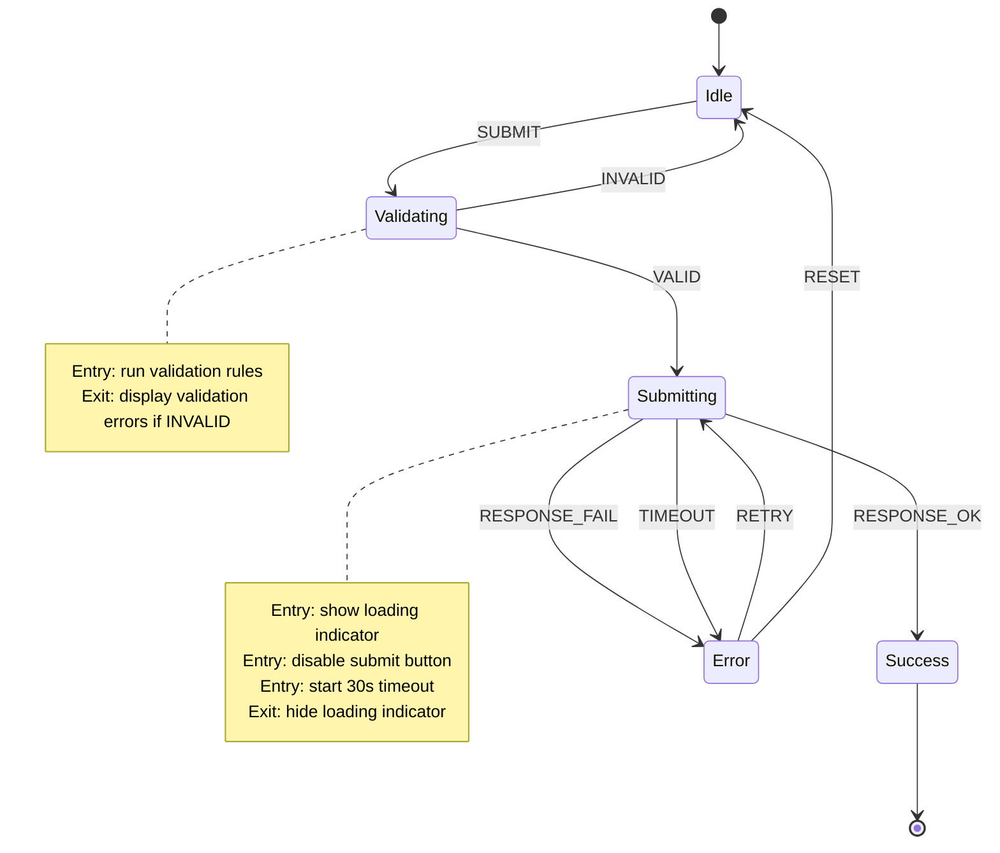

# Interaction Design (IxD) — Expertise Module

> An interaction designer defines how users engage with digital products through behavior, motion, feedback, and state transitions. The scope spans micro-interactions, gesture vocabularies, state modeling, animation specification, input method design, progressive disclosure, and the translation of interactive behavior into implementable specifications. Interaction design bridges user intent and system response — every tap, swipe, hover, and keypress must feel intentional, responsive, and predictable.

---

## 1. What This Discipline Covers

### Scope Definition

Interaction design is the practice of designing interactive digital products, environments, systems, and services. While visual design addresses what a product looks like, interaction design addresses how it behaves — the dialogue between a person and a product.

**Core domains:**

- **Interactive behavior** — Defining what happens when a user acts: clicks, taps, hovers, swipes, drags, types, speaks. Every user action requires a system reaction.
- **Micro-interactions** — Small, contained product moments that accomplish a single task: toggling a setting, liking a post, refreshing a feed, entering a password. Dan Saffer's framework decomposes these into triggers, rules, feedback, and loops/modes.
- **State machines and statecharts** — Formal modeling of every state a UI component or flow can occupy, the transitions between states, and the events that cause transitions. Prevents impossible states and undefined behavior.
- **Gesture design** — Defining touch, motion, and spatial input vocabularies: tap, long-press, swipe, pinch, rotate, drag, edge-swipe, force-touch, and emerging sensor-driven gestures.
- **Input methods** — Designing for mouse, keyboard, touch, stylus, voice, game controllers, screen readers, switch devices, eye tracking, and hybrid input contexts.
- **Animation and motion** — Specifying transitions, easing curves, durations, and choreography that communicate spatial relationships, hierarchy, causality, and state changes.
- **Feedback systems** — Visual, auditory, haptic, and multimodal feedback that confirms actions, communicates progress, signals errors, and maintains the user's sense of control.
- **Progressive disclosure** — Sequencing information and functionality to match the user's current need, reducing cognitive load while preserving access to advanced capabilities.

### Relationship to Adjacent Disciplines

IxD overlaps with but is distinct from: **Visual Design** (IxD defines states; visual design defines appearance per state), **UX Research** (research informs patterns; IxD operationalizes findings), **Information Architecture** (IA defines structure; IxD defines navigation behavior within it), **Motion Design** (IxD specifies functional motion; motion design handles expressive/brand motion), **Front-End Engineering** (IxD specifies behavior; engineering implements it), and **Content Design** (content informs microcopy; IxD defines when/how it appears).

---

## 2. Core Methods & Frameworks

### 2.1 Don Norman's Interaction Design Principles

Don Norman's principles from *The Design of Everyday Things* (1988, revised 2013) remain the foundational vocabulary for interaction design. Every interaction decision should be evaluated against these six principles.

**Affordances**
An affordance is a relationship between the properties of an object and the capabilities of the agent that determines how the object could possibly be used. A button affords pressing. A slider affords dragging. A text field affords typing. Digital affordances are perceived, not physical — they depend on visual and behavioral cues.

- Design controls whose appearance communicates their interactive behavior
- Flat design stripped affordances; ensure interactive elements are visually distinguishable from static content
- Test affordance perception: can a new user identify what is interactive within 3 seconds?

**Signifiers**
Signifiers are perceivable cues that indicate where and how to act. Affordances determine what actions are possible; signifiers communicate where the action should take place.

- Cursor changes (pointer, grab, text, resize) are signifiers on desktop
- Touch targets need visual signifiers because there is no hover state on mobile
- Scroll indicators, drag handles, chevrons, and underlines are all signifiers
- Absence of signifiers is the most common cause of "hidden" features

**Mapping**
The relationship between controls and their effects. Natural mapping leverages spatial correspondence and cultural standards.

- A volume slider that moves right to increase maps naturally to "more"
- Scroll direction should match the mental model (content-based vs. viewport-based)
- Group related controls spatially near the content they affect
- When mappings are arbitrary, they must be learned — minimize arbitrary mappings

**Constraints**
Constraints limit the range of possible interactions at any moment, preventing errors before they occur.

- Disable buttons when their action is not available (but always explain why)
- Use input masks to prevent invalid data entry (date pickers over free text)
- Physical constraints: touch target boundaries. Logical constraints: form validation rules
- Forcing functions: interlocks (confirm before delete), lock-ins (save before close), lock-outs (cooldown periods)

**Feedback**
Every action requires an appropriate, immediate, and informative reaction from the system.

- **Immediate feedback** (< 100ms): Button press states, toggle animations, ripple effects
- **Progress feedback** (100ms-10s): Loading spinners, progress bars, skeleton screens
- **Completion feedback** (> 1s operations): Success messages, confetti, check marks, toast notifications
- Feedback must be proportional — a minor action gets subtle feedback; a major/destructive action gets prominent confirmation
- Absence of feedback is the single most frustrating interaction failure

**Conceptual Model**
The user's internal understanding of how a system works. Good interaction design builds accurate mental models through consistent behavior.

- File/folder metaphors provide a conceptual model for data organization
- Undo/redo builds a model of reversible actions (linear history)
- Drag-and-drop builds a model of direct spatial manipulation
- When the conceptual model breaks (e.g., "save" does not persist), trust collapses

### 2.2 Cooper's Goal-Directed Design Process

Alan Cooper's methodology, detailed in *About Face: The Essentials of Interaction Design* (4th edition, 2014), centers interaction design on user goals rather than features or tasks. Goals are stable end conditions; tasks are transient means to achieve them.

**Phase 1 — Research:** Ethnographic interviews, contextual inquiry, stakeholder interviews. Observe what users do, not what they say.

**Phase 2 — Modeling:** Create personas (behavioral archetypes, not demographics) and map their goals: experience goals (how they want to feel), end goals (what they want to accomplish), and life goals (who they want to be).

**Phase 3 — Requirements Definition:** Define interaction requirements from persona goals. Context scenarios describe ideal future interactions without specifying UI. Key-path scenarios trace the most common flows.

**Phase 4 — Framework Design:** Define the interaction framework — structure, flow, and primary patterns. Classify product posture: sovereign (primary tool, full attention), transient (brief, occasional use), or daemonic (background, no UI).

**Phase 5 — Detail Design:** Specify every interaction state, edge case, error condition, and micro-interaction. This is where state machines, animation specs, and gesture maps are produced.

### 2.3 State Machines and Statecharts for UI

State machines provide a formal, visual, and executable model of interaction behavior. David Harel's statecharts (1987) extend basic state machines with hierarchy, parallelism, and history — making them practical for complex UIs.

**Why state machines for interaction design:**
- Every UI component exists in a finite number of states
- Transitions between states are triggered by specific events
- Actions (side effects) occur on transitions or on entering/exiting states
- Impossible states become structurally impossible, not just "shouldn't happen"

**Core concepts:**

```
States:       idle | loading | success | error | disabled
Events:       SUBMIT | CANCEL | RETRY | RESET | TIMEOUT
Transitions:  idle + SUBMIT → loading
              loading + SUCCESS_RESPONSE → success
              loading + ERROR_RESPONSE → error
              loading + TIMEOUT → error
              error + RETRY → loading
              success + RESET → idle
Guards:       idle + SUBMIT [if form valid] → loading
              idle + SUBMIT [if form invalid] → idle (show validation)
```

**Statechart extensions:**

- **Hierarchical states** (nested): A "form" state contains sub-states "editing", "validating", "submitting"
- **Parallel states** (orthogonal regions): A media player has independent "playback" (playing/paused/stopped) and "volume" (muted/unmuted) regions
- **History states**: Returning to a parent state resumes at the last active child (e.g., wizard resumes at last step)
- **Guards**: Conditional transitions — same event may lead to different states based on context
- **Entry/exit actions**: Side effects on state boundaries (e.g., start timer on entering "loading")

**Practical examples:**

```
Button:   enabled → hovered → pressed → loading → success|error → enabled
Modal:    closed → opening → open → closing → closed
          Guards: CLOSE [unsaved changes?] → confirm-discard (nested)
Wizard:   step1 ↔ step2 ↔ step3 → review → submitting → complete|error
          History: returning preserves current step
```

### 2.4 Gesture Vocabulary

Touch and gesture interactions require a defined vocabulary — a consistent set of gestures mapped to consistent behaviors throughout the product.

**Standard touch gesture vocabulary:**

| Gesture | Description | Common Mapping | Platform Standard |
|---|---|---|---|
| Tap | Single touch, quick release | Select, activate, toggle | Universal |
| Double-tap | Two taps in quick succession | Zoom in, select word | iOS, Android |
| Long-press | Touch and hold (> 500ms) | Context menu, drag initiation | iOS (haptic), Android |
| Swipe | Touch and slide in one direction | Navigate, dismiss, reveal actions | Universal |
| Pinch | Two fingers moving together | Zoom out | Maps, photos, web |
| Spread | Two fingers moving apart | Zoom in | Maps, photos, web |
| Rotate | Two fingers rotating | Rotate content | Maps, photo editing |
| Drag | Touch, hold, and move | Reorder, move objects | Universal |
| Edge swipe | Swipe from screen edge | Back navigation, reveal drawer | iOS (back), Android |
| Force touch / 3D touch | Pressure-sensitive press | Quick actions, peek/pop | iOS (deprecated on newer) |
| Multi-finger swipe | 3-4 finger swipe | App switching, desktop switching | iOS, macOS trackpad |

**Gesture design principles:**

1. **Discoverability** — Gestures are invisible by default. Provide onboarding hints, coach marks, or visual affordances (drag handles, swipe indicators) for non-obvious gestures
2. **Reversibility** — Every gesture should be undoable. Swipe-to-delete must offer undo. Drag-to-reorder must allow dragging back
3. **Tolerance** — Accept imprecise input. A "swipe" should work at angles up to 30 degrees off-axis. A "tap" should tolerate minor finger movement (< 10px)
4. **Conflict avoidance** — Never map conflicting gestures to overlapping areas. Horizontal swipe in a vertically scrolling list requires careful threshold tuning
5. **Platform respect** — Never override system-level gestures (iOS swipe-from-left-edge for back, Android back gesture, three-finger screenshot). Users expect these to work everywhere
6. **Accessibility** — Every gesture must have a non-gesture alternative: a button, a menu item, or a keyboard shortcut. Single-pointer alternatives are required by WCAG 2.2 SC 2.5.7

### 2.5 Fitts's Law

Formulated by Paul Fitts in 1954, Fitts's Law predicts the time required to move to a target based on the target's size and distance from the current position. It is the most validated model in human motor behavior.

**The model:**
```
T = a + b * log2(1 + D/W)

T = time to reach the target
D = distance from starting point to target center
W = width (size) of the target along the axis of movement
a, b = empirically derived constants
```

**Design implications:**

- **Make important targets large.** Primary actions (Submit, Save, Next) should have generous touch/click targets. WCAG 2.2 requires minimum 24x24 CSS pixels; Apple HIG recommends 44x44 points; Material Design recommends 48x48 dp
- **Reduce distance to frequent targets.** Place primary actions near the user's current focus area. Contextual menus, inline editing, and floating action buttons reduce travel distance
- **Exploit screen edges and corners.** On desktop, targets at screen edges have effectively infinite depth — the cursor stops at the edge. macOS places the menu bar at the top edge; Windows places the Start button at a corner. Both leverage Fitts's Law
- **The "magic pixel" at edges.** On desktop, elements flush to screen edges are fastest to acquire. On mobile, bottom-of-screen placement is fastest for thumb reach (thumb zone)
- **Avoid tiny targets near large targets.** A small "cancel" link next to a large "delete" button is a Fitts's Law error — users will accidentally hit delete

### 2.6 Hick's Law (Hick-Hyman Law)

Hick's Law states that the time to make a decision increases logarithmically with the number of choices.

**The model:**
```
T = b * log2(n + 1)

T = decision time
n = number of equally probable choices
b = empirically derived constant
```

**Design implications:**

- **Limit choices in navigation menus.** 5-7 top-level navigation items is a well-tested range. Beyond 7, group into categories
- **Progressive disclosure over flat display.** Present 3-5 options now; reveal more on demand. This is the foundation of wizards, staged forms, and drill-down menus
- **Highlight the recommended option.** When choices cannot be reduced, visually distinguish the most common or recommended choice (primary button vs. secondary buttons)
- **Hick's Law applies less to familiar, ordered lists.** A scrollable alphabetical contact list does not impose Hick's Law overhead because users use search/scan strategies rather than evaluating each option
- **Reduce choices through smart defaults.** Pre-selecting the most common option (shipping method, country, currency) eliminates a decision for the majority of users

### 2.7 Progressive Disclosure

Coined by JM Keller and refined by Jakob Nielsen at NNG, progressive disclosure is the practice of deferring advanced or secondary information and functionality to secondary screens, expandable sections, or on-demand reveals.

**Implementation patterns:**

| Pattern | When to Use | Example |
|---|---|---|
| Staged form (wizard) | Multi-step processes with > 7 fields | Checkout: shipping, payment, review |
| Expandable sections (accordion) | Reference content with clear categories | FAQ pages, settings panels |
| Tabs | Parallel categories of equal importance | Profile: Overview, Activity, Settings |
| Tooltips / popovers | Supplementary explanation on demand | Info icon next to a form label |
| "Show more" / "Advanced" | Power-user options that most users skip | Print dialog, search filters |
| Drill-down navigation | Hierarchical content with depth > 2 levels | File browsers, category trees |
| Inline expansion | Detail within a list without leaving context | Email preview in inbox list |
| Modal / dialog | Focused sub-task requiring attention | Confirmation, complex input |

**Design rules:**

1. The primary/default view must be self-sufficient for the most common task
2. Disclosed content must be clearly reachable — never hide critical functionality
3. The trigger for disclosure must be visible and labeled (not just an icon)
4. Disclosed content should appear near its trigger (spatial proximity)
5. Users must be able to collapse/dismiss disclosed content
6. State of disclosure should persist within a session (do not collapse on scroll)

### 2.8 Direct Manipulation

Introduced by Ben Shneiderman in 1983, direct manipulation interfaces allow users to act on visible objects through physical actions rather than abstract commands.

**Core properties (Shneiderman):**
1. Continuous representation of objects and actions of interest
2. Physical actions (clicking, dragging, resizing) instead of typed commands
3. Rapid, incremental, reversible operations
4. Immediate visible feedback of results

**Modern applications:**

- **Drag-and-drop**: Reordering lists, moving items between containers, file management
- **Inline editing**: Click text to edit in place, no modal form required
- **Resize handles**: Drag edges/corners to resize images, columns, panels
- **Direct-on-canvas editing**: Design tools (Figma), spreadsheets, map editors
- **Slider controls**: Continuous value adjustment with immediate preview
- **WYSIWYG editors**: Rich text editing where formatting is immediately visible

**Design requirements:** The object must be visually identifiable and selectable. Manipulation must have continuous visible effect (not just start/end). Undo must be available. Constraints must be communicated during manipulation (snap guides, boundary indicators). The final state must be clearly distinguished from the original.

---

## 3. Deliverables

### 3.1 Interaction Specifications

The interaction specification (interaction spec) is the primary deliverable — a detailed document describing every interactive behavior in the product.

**Structure of an interaction spec:**

```
Component: [Name]
Description: [What it does, when it appears]

States:
  - Default: [description + visual reference]
  - Hover: [description + visual reference]
  - Active/Pressed: [description + visual reference]
  - Focused: [description + visual reference]
  - Disabled: [description + visual reference]
  - Loading: [description + visual reference]
  - Error: [description + visual reference]
  - Success: [description + visual reference]

Interactions:
  - Click/Tap: [behavior description]
  - Keyboard: [Tab order, Enter/Space activation, Escape dismissal]
  - Long-press: [if applicable]
  - Swipe: [if applicable]

Transitions:
  - Default → Hover: [trigger, duration, easing]
  - Default → Active: [trigger, duration, easing]
  - Default → Loading: [trigger, animation description]
  - Loading → Success: [trigger, duration, animation]
  - Loading → Error: [trigger, error message location, retry behavior]

Edge Cases:
  - Rapid double-click: [debounce? second action ignored?]
  - Network failure during loading: [timeout duration, retry logic]
  - Content overflow: [truncation, scroll, expansion]

Accessibility:
  - ARIA role: [role]
  - ARIA states: [aria-pressed, aria-expanded, etc.]
  - Screen reader announcement: [what is read on state change]
  - Keyboard shortcut: [if applicable]
```

### 3.2 State Diagrams

State diagrams visualize the complete lifecycle of a component or flow. They serve as the single source of truth for "what can happen from here."

**Deliverable requirements:**
- Every state must be named and visually distinct
- Every transition must be labeled with the triggering event
- Guard conditions must be noted on conditional transitions
- Entry and exit actions must be documented
- Error states and recovery paths must be explicitly modeled
- "Happy path" should be visually emphasized (thicker lines, color coding)

**Formats:**
- Mermaid or PlantUML statechart diagrams (version-controllable, embeddable in docs)
- XState visual editor exports (executable and visual)
- Figma/FigJam diagram boards (collaborative, but not executable)
- Stately.ai visual editor (generates XState code)

**Example in Mermaid syntax:**


### 3.3 Animation Specifications

Animation specs translate motion intent into implementable parameters. Every animated transition requires a specification.

**Required parameters per animation:**

| Parameter | Description | Example |
|---|---|---|
| Property | What CSS/native property changes | opacity, transform, height |
| Duration | How long the animation takes | 200ms |
| Easing | Acceleration curve | ease-out, cubic-bezier(0.4, 0, 0.2, 1) |
| Delay | Time before animation starts | 0ms, 50ms (staggered) |
| Direction | Forward, reverse, or alternate | forward |
| Trigger | What initiates the animation | on-mount, on-click, on-scroll |
| Fill mode | State after animation ends | forwards (maintain end state) |

**Duration guidelines (NNG and Material Design 3):**

| Interaction Type | Duration Range | Rationale |
|---|---|---|
| Micro-feedback (ripple, press) | 50-100ms | Must feel instantaneous |
| Small transitions (fade, color) | 100-200ms | Quick but perceivable |
| Medium transitions (slide, expand) | 200-350ms | Readable motion path |
| Large transitions (page, modal) | 300-500ms | Complex spatial change |
| Complex choreography | 400-700ms | Multiple coordinated elements |
| Never exceed | 1000ms | Feels sluggish; blocks user flow |

**Easing curve vocabulary (Material Design 3):**

- **Standard (ease-in-out)**: `cubic-bezier(0.2, 0, 0, 1)` — Elements moving between on-screen positions
- **Emphasized**: `cubic-bezier(0.2, 0, 0, 1)` with longer duration — Large, dramatic transitions
- **Emphasized decelerate**: `cubic-bezier(0.05, 0.7, 0.1, 1)` — Elements entering the screen
- **Emphasized accelerate**: `cubic-bezier(0.3, 0, 0.8, 0.15)` — Elements leaving the screen
- **Standard decelerate**: `cubic-bezier(0, 0, 0, 1)` — Elements entering from off-screen
- **Standard accelerate**: `cubic-bezier(0.3, 0, 1, 1)` — Elements leaving to off-screen
- **Linear**: `cubic-bezier(0, 0, 1, 1)` — Only for progress bars and continuous rotation

**Anti-pattern: decorative motion without purpose.** Every animation must answer: "What does this help the user understand?" If the answer is "nothing — it just looks cool," remove it.

### 3.4 Gesture Maps

A gesture map documents every gesture recognized by the product, organized by context/screen.

**Format:**

```
Screen/Context: [Name]

| Gesture       | Target Area     | Action                    | Feedback              | Undo           |
|---------------|-----------------|---------------------------|-----------------------|----------------|
| Tap           | List item       | Open detail view          | Ripple + navigate     | Back button    |
| Swipe left    | List item       | Reveal delete action      | Red background slides | Swipe right    |
| Swipe right   | List item       | Reveal archive action     | Green background      | Swipe left     |
| Long-press    | List item       | Enter selection mode      | Haptic + checkbox     | Tap to deselect|
| Pinch         | Image           | Zoom out                  | Smooth scale          | Spread         |
| Pull down     | List (top)      | Refresh content           | Pull indicator + spin | N/A            |
| Edge swipe    | Left edge       | Navigate back             | Page peek animation   | N/A            |

Conflicts: None. Swipe gestures require > 50px horizontal movement before activating,
           preventing conflict with vertical scroll.

Accessibility alternatives:
  - Swipe actions: overflow menu (three-dot) on each list item
  - Long-press: checkbox visible in toolbar "Select" mode
  - Pinch: zoom buttons overlay in bottom-right corner
```

### 3.5 Prototype Specifications

Prototype specs define what the prototype must demonstrate, at what fidelity, and for what audience.

| Level | Purpose | Tools |
|---|---|---|
| Paper / sketch | Explore concepts, test flow | Paper, whiteboard |
| Low-fidelity wireframe | Validate IA and flow | Figma, Balsamiq |
| Mid-fidelity interactive | Test core interactions | Figma prototyping, ProtoPie |
| High-fidelity interaction | Validate micro-interactions, animation, gesture | ProtoPie, Principle, Framer |
| Code prototype | Test real performance, data, gestures | HTML/CSS/JS, React, SwiftUI |

**Prototype spec must include:** Scope (which flows), fidelity (real vs. simulated elements), data source (static/seeded/live), target devices and input methods, success criteria (usability metrics), and known limitations.

---

## 4. Tools & Techniques

### 4.1 Prototyping Tools

**Figma Prototyping**
- Native prototyping within design files — no context switch
- Supports smart animate (auto-interpolation between frames), component variants for state changes, conditional logic (variables), and mathematical expressions
- Best for: Mid-fidelity flows, component state demonstrations, stakeholder walkthroughs
- Limitation: Limited physics simulation, no sensor input, gesture support is basic

**ProtoPie**
- Code-free interaction prototyping with formula-based logic
- Supports sensor inputs (tilt, sound, compass), multi-device prototyping (phone-to-watch), conditional logic, and variables
- Best for: Complex multi-step interactions, IoT prototypes, usability testing of advanced interactions
- Exports interaction recordings and can run on real devices via ProtoPie Player

**Principle**
- Timeline-based animation tool for macOS
- Excels at transition design between screens with fine-grained easing and keyframe control
- Best for: Animated transitions, motion design exploration, hero animations
- Limitation: macOS only, limited logic/conditions, less active development in recent years

**Framer**
- Code-aware prototyping platform with React-based components
- Supports real code components, API integration, responsive layouts
- Best for: Teams with frontend developers, production-like prototypes, design-to-code workflow
- Higher learning curve; requires comfort with code concepts

**Origami Studio (Meta)**
- Patch-based visual programming with physics simulations and state management
- Best for: Complex gesture-driven interactions, VR/AR prototyping

### 4.2 State Machine Tools

**XState / Stately.ai**
- JavaScript/TypeScript library implementing statecharts (Harel formalism)
- Visual editor at stately.ai generates executable XState code
- Integrations: React (`@xstate/react`), Vue (`@xstate/vue`), Svelte (`@xstate/svelte`)
- Use for: Modeling complex component behavior, form flows, multi-step processes, authentication flows
- Designers can use the visual editor; engineers get executable code

**State machine design process:**
1. List all possible states the component/flow can be in
2. List all events that can occur in each state
3. Define transitions: state + event = new state
4. Add guard conditions for conditional transitions
5. Add entry/exit actions for side effects
6. Validate: is every state reachable? Is every state escapable? Are there dead ends?
7. Test: walk through every path with the team

### 4.3 Interaction Documentation Techniques

**Annotated screen specifications:**
- Screenshot or mockup with numbered callouts
- Each callout references a detailed interaction behavior note
- Include state variations as additional annotated screens
- Tools: Figma annotation plugins, Zeplin, Specify

**Interactive documentation:** Storybook with interaction tests (`play` functions), live component playgrounds showing every state, embedded ProtoPie or Figma prototypes in documentation pages.

**Video walkthroughs:** Screen recordings narrated with interaction intent. Useful for async handoff but always supplement with written specs — video is not searchable or diffable.

**Decision tables for complex logic:**

```
| Condition A        | Condition B         | Condition C      | Result              |
|--------------------|---------------------|------------------|---------------------|
| User logged in     | Has saved items     | Cart not empty   | Show checkout CTA   |
| User logged in     | Has saved items     | Cart empty       | Show saved items    |
| User logged in     | No saved items      | Cart empty       | Show recommendations|
| User not logged in | —                   | Cart not empty   | Show login prompt   |
| User not logged in | —                   | Cart empty       | Show sign-up CTA    |
```

---

## 5. Common Failures

### 5.1 Over-Animation

**Symptoms:** Every element bounces/fades/slides on every interaction. Animations exceed 500ms for simple changes. Multiple simultaneous animations compete for attention. Decorative motion that communicates no meaning.

**Consequences:** Perceived slowness. Motion-sensitive users experience discomfort (vestibular disorders affect ~35% of adults over 40). Accumulated animation delays degrade task completion time. Users disable animations system-wide via `prefers-reduced-motion`, losing functional transitions too.

**Fixes:** Apply the "does this help the user understand?" test. Respect `prefers-reduced-motion`. Use animation only for spatial relationships, state changes, cause-and-effect, and continuity. Limit simultaneous animations to 2-3 elements. Target 150-250ms for most transitions.

### 5.2 Inconsistent Interactions

**Symptoms:** Same gesture does different things across contexts. Swipe works in some lists but not others. Back button behavior varies between screens. Tap sometimes selects, sometimes navigates, sometimes expands.

**Consequences:** Users cannot build reliable mental models. Error rates increase. Trust erodes.

**Fixes:** Create an interaction pattern library documenting every gesture and its consistent meaning. Audit the full product with a gesture map. When context-dependent behavior is necessary, provide clear visual/spatial differentiation. Adopt platform conventions (Material Design, Apple HIG) as baseline.

### 5.3 No Feedback (Silent Failures)

**Symptoms:** Button tap produces no visible change. Form submission fails silently. Background save completes without confirmation. Loading state is not indicated. Toggles change state but nothing else visibly responds.

**Consequences:** Users repeat actions (double-submit, duplicate purchases). Users assume broken system and abandon. Support tickets increase.

**Fixes:** Every interactive element needs a visible pressed/active state (< 100ms). Every async action shows a loading indicator. Every completion shows success confirmation. Every failure shows what happened, why, and what to do next. Test with network throttling and airplane mode.

### 5.4 Breaking Platform Gestures

**Symptoms:** Custom swipe overrides iOS back-swipe. Custom scroll conflicts with browser pull-to-refresh. Keyboard shortcuts override browser shortcuts (Cmd+W, Cmd+T).

**Consequences:** Users feel trapped. Accessibility features break. App store rejection risk (Apple).

**Fixes:** Never override system-level gestures. Test on real devices with system gestures enabled. Use platform gesture recognizer APIs for priority/conflict resolution. iOS: `UIScreenEdgePanGestureRecognizer`. Android: predictive back gesture API (Android 14+). Web: never `preventDefault` on touch events at document level.

### 5.5 Cognitive Overload from Excessive Interactions

**Symptoms:** Every element on screen is interactive (no visual rest areas). Multiple competing CTAs with equal visual weight. Complex multi-gesture sequences for basic tasks. No clear primary action.

**Consequences:** Decision paralysis (Hick's Law). Users default to familiar paths only. Accidental triggers increase. Task completion time suffers.

**Fixes:** Apply visual hierarchy: one primary action, one or two secondary, everything else tertiary. Use progressive disclosure. Limit interactive elements to current need. Provide "do nothing" safe zones. Test with the five-second test: can users identify the primary action within 5 seconds?

### 5.6 Ignoring Keyboard and Non-Pointer Input

**Symptoms:** Custom components not focusable via Tab. No visible focus indicators. Enter/Space do not activate custom buttons. Escape does not close modals. Arrow keys do not navigate composite widgets.

**Consequences:** Keyboard-only users are blocked. WCAG 2.1 SC 2.1.1 failure — legal risk. Screen reader users cannot operate the interface.

**Fixes:** Use native HTML elements (`<button>`, `<input>`, `<select>`, `<a>`) for built-in keyboard behavior. Follow WAI-ARIA Authoring Practices for custom widgets. Match every `:hover` style with `:focus-visible`. Test every flow keyboard-only. Implement focus management: move focus into modals on open, return to trigger on close.

---

## 6. Integration with Development

### 6.1 Translating Interaction Specs to Code

**The handoff gap:** Interaction specs describe behavior; code implements it. The gap between the two is the most common source of interaction defects. Close it with these practices.

**Specification format for engineers:**

```
Component: SearchField
Trigger: User types in search field

Behavior:
  1. On keyup (debounced 300ms), fire search request
  2. Show loading spinner inside field (right side)
  3. If results returned within 2s:
     - Fade in results dropdown (200ms, ease-out)
     - Highlight first result
  4. If no results:
     - Show "No results for [query]" message in dropdown
  5. If error:
     - Show inline error message below field
     - Do NOT show dropdown
  6. On Escape key: close dropdown, clear field
  7. On ArrowDown: move highlight to next result
  8. On Enter: select highlighted result
  9. On blur (field loses focus): close dropdown after 150ms delay
     (delay allows click on dropdown item to register first)

State machine: idle → searching → results | no-results | error → idle
```

**Key translation points:**
- Durations must be in milliseconds (not frames or seconds)
- Easing curves must be CSS `cubic-bezier()` values or named equivalents
- Breakpoints for responsive interaction changes must be specified in pixels/rems
- Touch target sizes must be in platform-native units (dp for Android, pt for iOS, px/rem for web)
- Debounce and throttle values must be specified for input handlers

### 6.2 Animation Libraries by Platform

**Web:**
- **CSS Transitions/Animations**: For simple state transitions (hover, focus, visibility). Zero dependency. Best performance for transform and opacity
- **Web Animations API (WAAPI)**: Native browser API for programmatic animation. Good for sequencing and dynamic values
- **Framer Motion** (React): Declarative animation with `animate`, `exit`, layout animations, gesture handlers, and `useReducedMotion` hook
- **GSAP (GreenSock)**: Professional-grade timeline animation. Complex choreography, scroll-triggered animation, morphing. License required for some plugins
- **Motion One**: Lightweight (< 5KB) animation library built on WAAPI. Good balance of power and bundle size
- **View Transitions API**: Native browser API for page-to-page transitions. Progressive enhancement approach

**iOS/macOS:**
- **UIView.animate / SwiftUI .animation**: Built-in animation system with spring, easing, and keyframe support
- **Core Animation (CAAnimation)**: Lower-level, higher control for complex layer animations
- **Lottie (iOS)**: Render After Effects animations natively

**Android:**
- **Jetpack Compose animation**: Declarative animations with `animateXAsState`, `AnimatedVisibility`, `Crossfade`
- **MotionLayout**: Complex motion and widget animation in XML-based layouts
- **Lottie (Android)**: Render After Effects animations natively

**Cross-platform (Flutter):**
- **Implicit animations**: `AnimatedContainer`, `AnimatedOpacity` — declare end state, Flutter interpolates
- **Explicit animations**: `AnimationController` + `Tween` for precise control
- **Hero animations**: Shared element transitions between screens
- **Rive**: Runtime animation engine with state machine support

### 6.3 Gesture Handlers by Platform

**Web:**
- Native `PointerEvent` API (unified mouse, touch, pen input)
- `touch-action` CSS property to control which gestures the browser handles vs. JavaScript
- Libraries: Hammer.js (legacy), `use-gesture` (React), `@vueuse/gesture` (Vue)
- Intersection Observer for scroll-triggered interactions

**iOS:**
- `UIGestureRecognizer` subclasses: `UITapGestureRecognizer`, `UIPanGestureRecognizer`, `UIPinchGestureRecognizer`, `UISwipeGestureRecognizer`, `UILongPressGestureRecognizer`, `UIRotationGestureRecognizer`
- SwiftUI: `.gesture()` modifier with `DragGesture`, `TapGesture`, `LongPressGesture`, `MagnificationGesture`, `RotationGesture`
- Gesture recognizer delegation for conflict resolution (`shouldRecognizeSimultaneouslyWith`)

**Android:**
- `GestureDetector`, `ScaleGestureDetector` in View system
- Jetpack Compose: `Modifier.pointerInput()`, `detectTapGestures`, `detectDragGestures`, `detectTransformGestures`
- `MotionEvent` for raw touch data

**Flutter:**
- `GestureDetector` widget: `onTap`, `onDoubleTap`, `onLongPress`, `onPanUpdate`, `onScaleUpdate`
- `Dismissible` widget for swipe-to-dismiss
- `Draggable` and `DragTarget` for drag-and-drop
- Custom gesture recognizers via `GestureRecognizer` subclasses

### 6.4 State Management Mapping

The interaction designer's state diagram must map directly to the developer's state management implementation. Misalignment here causes "works in the prototype, breaks in production."

**Mapping table:**

| IxD Concept | React | SwiftUI | Jetpack Compose | Flutter |
|---|---|---|---|---|
| State | `useState`, XState context | `@State`, `@StateObject` | `mutableStateOf` | `ValueNotifier`, `Bloc state` |
| Transition | XState transition, `useReducer` dispatch | Binding + onChange | `LaunchedEffect` | `Bloc event` → `emit` |
| Guard condition | XState guard, conditional dispatch | `if` in action closure | `if` in event handler | `Bloc` conditional emit |
| Side effect (entry action) | `useEffect`, XState `entry` action | `.onAppear`, `.task` | `LaunchedEffect` | `BlocListener`, `initState` |
| Parallel states | Multiple XState actors, multiple `useState` | Multiple `@State` properties | Multiple state holders | Multiple `Bloc` instances |
| Derived state | `useMemo`, XState selectors | Computed properties | `derivedStateOf` | `BlocBuilder` with `buildWhen` |

**Best practice:** When using XState, the state machine is the single source of truth. UI components read state from the machine and send events to it. No local UI state should contradict the machine's state. This guarantees that the implemented interaction matches the designed interaction.

### 6.5 Design-Development Collaboration Model

**Shared language:** Use identical state names in design specs and code (`idle`, `loading`, `error` — not "default", "spinner screen", "red state"). Use identical event names (`SUBMIT`, `CANCEL`, `RETRY`). Reference easing curves by shared design token names (`$motion-ease-out`, `$duration-fast`).

**Review checkpoints:** At spec handoff, engineers confirm feasibility while designers confirm completeness. During implementation, designers review on real devices while engineers flag deviations with rationale. At QA, designers participate in interaction-specific test cases. Post-launch, track interaction success rates and animation frame rate performance.

---

## 7. Key References

### Foundational Texts

- **Norman, Don.** *The Design of Everyday Things* (revised 2013). The foundational text on affordances, signifiers, mappings, constraints, feedback, and conceptual models.
- **Cooper, Alan; Reimann, Robert; Cronin, David; Noessel, Christopher.** *About Face: The Essentials of Interaction Design* (4th edition, 2014). Goal-directed design, personas, postures, and the complete interaction design process.
- **Saffer, Dan.** *Microinteractions: Designing with Details* (2013). The definitive framework for triggers, rules, feedback, and loops/modes in micro-interactions.
- **Shneiderman, Ben.** *Designing the User Interface* (6th edition, 2016). Direct manipulation, eight golden rules of interface design.
- **Harel, David.** "Statecharts: A Visual Formalism for Complex Systems" (1987). The formal foundation for hierarchical, parallel state modeling.

### Research and Guidelines

- **Nielsen Norman Group (NNG)**: Ongoing research on interaction patterns, usability heuristics, animation guidelines. [nngroup.com](https://www.nngroup.com/topic/interaction-design/)
- **Material Design 3 — Motion**: Google's motion and easing guidelines. [m3.material.io/styles/motion](https://m3.material.io/styles/motion/easing-and-duration)
- **Apple Human Interface Guidelines — Inputs**: Gesture and input design for Apple platforms. [developer.apple.com/design](https://developer.apple.com/design/human-interface-guidelines/)
- **Laws of UX**: Concise reference for Fitts's Law, Hick's Law, and other psychological principles applied to design. [lawsofux.com](https://lawsofux.com/)

### Tools

- **XState / Stately.ai**: State machine modeling and code generation. [stately.ai](https://stately.ai/)
- **ProtoPie**: Advanced interaction prototyping. [protopie.io](https://www.protopie.io/)
- **Framer**: Code-aware design and prototyping. [framer.com](https://www.framer.com/)
- **Principle**: Motion and transition design for macOS. [principleformac.com](https://principleformac.com/)

---

## Quick Reference Checklist

Use this checklist to evaluate any interaction design before handoff.

### Feedback & Response

- [ ] Every interactive element has a visible pressed/active state
- [ ] Response to user input is visible within 100ms
- [ ] Loading states are shown for any operation > 1 second
- [ ] Success is confirmed visually after every completed action
- [ ] Errors explain what happened, why, and what to do next
- [ ] Feedback intensity is proportional to action significance

### States & Transitions

- [ ] Every component has all states defined: default, hover, active, focused, disabled, loading, error, success
- [ ] State diagram exists for every multi-state component or flow
- [ ] No impossible states exist (cannot be both "loading" and "error" simultaneously)
- [ ] Every state is reachable and escapable (no dead ends)
- [ ] Transitions between states have defined duration and easing
- [ ] Guard conditions are documented for conditional transitions

### Gestures & Input

- [ ] Every gesture has a non-gesture alternative (button, menu, keyboard shortcut)
- [ ] Platform system gestures are never overridden
- [ ] Touch targets meet minimum size (24x24px WCAG, 44x44pt iOS, 48x48dp Android)
- [ ] Gesture conflicts are identified and resolved (swipe vs. scroll, etc.)
- [ ] Keyboard navigation works for every interactive flow
- [ ] Focus order is logical and follows visual layout
- [ ] Focus indicators are visible and meet WCAG contrast requirements

### Animation & Motion

- [ ] Every animation serves a functional purpose (not purely decorative)
- [ ] Durations are appropriate: 100-200ms for micro, 200-350ms for medium, 300-500ms for large
- [ ] No animation exceeds 1000ms (unless progress indicator or deliberate storytelling)
- [ ] `prefers-reduced-motion` is respected — reduced or eliminated non-essential motion
- [ ] Easing curves are specified as CSS cubic-bezier values
- [ ] Simultaneous animations are limited to 2-3 elements maximum

### Progressive Disclosure

- [ ] Default view is self-sufficient for the primary task
- [ ] Advanced options are accessible but not competing for attention
- [ ] Disclosure triggers are visible and labeled (not hidden behind unlabeled icons)
- [ ] Disclosed content appears near its trigger
- [ ] Users can collapse disclosed content
- [ ] Disclosure state persists within session

### Consistency

- [ ] Same gesture = same action throughout the product
- [ ] Same action = same feedback throughout the product
- [ ] Interaction patterns align with platform conventions (Material, HIG)
- [ ] Interaction pattern library is documented and referenced
- [ ] Edge cases and error states are handled consistently across features

### Cognitive Load (Norman + Hick + Fitts)

- [ ] Primary action is visually dominant (Fitts: large and close)
- [ ] Number of choices per view is limited to 5-7 where decisions are required (Hick)
- [ ] Controls map naturally to their effects (Norman: mapping)
- [ ] Constraints prevent errors before they occur (Norman: constraints)
- [ ] Conceptual model is consistent and learnable (Norman: conceptual model)
- [ ] Affordances and signifiers clearly communicate interactivity (Norman: affordances + signifiers)

### Accessibility

- [ ] All custom widgets follow WAI-ARIA Authoring Practices keyboard patterns
- [ ] ARIA roles and states are specified for custom components
- [ ] Screen reader announcements are defined for dynamic state changes
- [ ] No interaction depends solely on color, hover, or precise motor control
- [ ] Every drag operation has a single-pointer alternative (WCAG 2.2 SC 2.5.7)

### Handoff Readiness

- [ ] Interaction spec covers every state, transition, and edge case
- [ ] State names and event names match between design spec and code
- [ ] Animation specs include duration (ms), easing (cubic-bezier), and property
- [ ] Gesture map documents all gestures per screen with conflict analysis
- [ ] Prototype demonstrates the most complex interaction flows
- [ ] Design tokens for motion (duration, easing) are defined in shared token system
- [ ] Engineer has reviewed spec for feasibility before implementation begins
